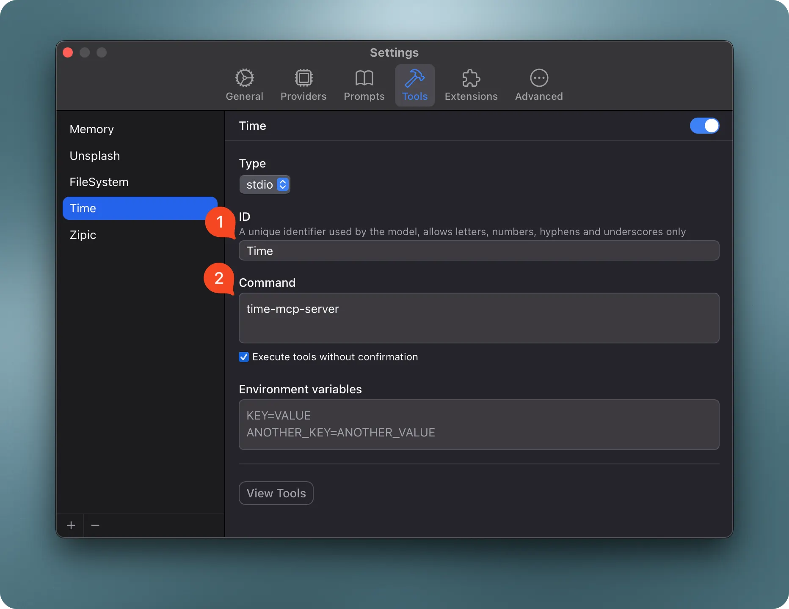

# Time MCP Server

> A Model Context Protocol server that provides time-related capabilities. This server enables LLMs to access current time information and convert times between different timezones. This is a Swift implementation of a time MCP server using the MCP Swift SDK.


## ✨ Features

* **Current Time Queries**: Get the current time in any timezone
* **Time Zone Conversions**: Convert time between different timezones
* **Daylight Saving Time Information**: Check if a timezone is currently in DST
* **Time Difference Calculation**: Get the time difference between timezones when converting

## Available Tools

* `get_current_time` - Get the current time in a specific timezone
  * `timezone` (string, required): IANA timezone name (e.g., 'America/New_York', 'Europe/London'). If empty or not provided, the system timezone will be used.

* `convert_time` - Convert time between timezones
  * `source_timezone` (string, required): Source IANA timezone name. If empty or not provided, the system timezone will be used.
  * `time` (string, required): Time to convert in 24-hour format (HH:MM)
  * `target_timezone` (string, required): Target IANA timezone name. If empty or not provided, the system timezone will be used.

## Installation

### Option 1: Download Pre-built Binary

Download the latest pre-built binary for your platform from the [GitHub Releases](https://github.com/okooo5km/time-mcp-server/releases/latest) page:

Download the binary for your platform from the [GitHub Releases](https://github.com/okooo5km/time-mcp-server/releases/latest) page and follow the installation instructions below.

<details>
<summary><b>macOS Installation</b></summary>

#### macOS with Apple Silicon (M1/M2/M3):
```bash
# Download the arm64 version
curl -L https://github.com/okooo5km/time-mcp-server/releases/latest/download/time-mcp-server-macos-arm64.zip -o time-mcp-server.zip
unzip time-mcp-server.zip
chmod +x time-mcp-server

# Remove quarantine attribute to avoid security warnings
xattr -d com.apple.quarantine time-mcp-server

# Install to your local bin directory
mkdir -p ~/.local/bin
mv time-mcp-server ~/.local/bin/
rm time-mcp-server.zip
```

#### macOS with Intel Processor:
```bash
# Download the x86_64 version
curl -L https://github.com/okooo5km/time-mcp-server/releases/latest/download/time-mcp-server-macos-x86_64.zip -o time-mcp-server.zip
unzip time-mcp-server.zip
chmod +x time-mcp-server

# Remove quarantine attribute to avoid security warnings
xattr -d com.apple.quarantine time-mcp-server

# Install to your local bin directory
mkdir -p ~/.local/bin
mv time-mcp-server ~/.local/bin/
rm time-mcp-server.zip
```

#### macOS Universal Binary (works on both Apple Silicon and Intel):
```bash
# Download the universal version
curl -L https://github.com/okooo5km/time-mcp-server/releases/latest/download/time-mcp-server-macos-universal.zip -o time-mcp-server.zip
unzip time-mcp-server.zip
chmod +x time-mcp-server

# Remove quarantine attribute to avoid security warnings
xattr -d com.apple.quarantine time-mcp-server

# Install to your local bin directory
mkdir -p ~/.local/bin
mv time-mcp-server ~/.local/bin/
rm time-mcp-server.zip
```
</details>

<details>
<summary><b>Linux Installation</b></summary>

#### Linux on x86_64 (most common):
```bash
# Download the amd64 version
curl -L https://github.com/okooo5km/time-mcp-server/releases/latest/download/time-mcp-server-linux-amd64.tar.gz -o time-mcp-server.tar.gz
tar -xzf time-mcp-server.tar.gz
chmod +x time-mcp-server

# Install to your local bin directory
mkdir -p ~/.local/bin
mv time-mcp-server ~/.local/bin/
rm time-mcp-server.tar.gz
```

#### Linux on ARM64 (e.g., Raspberry Pi 4, AWS Graviton):
```bash
# Download the arm64 version
curl -L https://github.com/okooo5km/time-mcp-server/releases/latest/download/time-mcp-server-linux-arm64.tar.gz -o time-mcp-server.tar.gz
tar -xzf time-mcp-server.tar.gz
chmod +x time-mcp-server

# Install to your local bin directory
mkdir -p ~/.local/bin
mv time-mcp-server ~/.local/bin/
rm time-mcp-server.tar.gz
```
</details>

<details>
<summary><b>Windows Installation</b></summary>

#### Windows on x86_64 (most common):
- Download the [Windows AMD64 version](https://github.com/okooo5km/time-mcp-server/releases/latest/download/time-mcp-server-windows-amd64.zip)
- Extract the ZIP file
- Move the `time-mcp-server.exe` to a location in your PATH

#### Windows on ARM64 (e.g., Windows on ARM devices):
- Download the [Windows ARM64 version](https://github.com/okooo5km/time-mcp-server/releases/latest/download/time-mcp-server-windows-arm64.zip)
- Extract the ZIP file
- Move the `time-mcp-server.exe` to a location in your PATH
</details>

Make sure the installation directory is in your PATH:

- **macOS/Linux**: Add `export PATH="$HOME/.local/bin:$PATH"` to your shell configuration file (`.bashrc`, `.zshrc`, etc.)
- **Windows**: Add the directory to your system PATH through the System Properties > Environment Variables dialog

### Option 2: Build from Source

1. Clone the repository:

   ```bash
   git clone https://github.com/okooo5km/time-mcp-server.git
   cd time-mcp-server
   ```

2. Build the project:

   **Using Make (recommended):**
   ```bash
   # Build for your current platform
   make
   
   # Or build for a specific platform
   make build-darwin-universal    # macOS Universal Binary
   make build-darwin-arm64        # macOS Apple Silicon
   make build-darwin-amd64        # macOS Intel
   make build-linux-amd64         # Linux x86_64
   make build-linux-arm64         # Linux ARM64
   make build-windows-amd64       # Windows x86_64
   
   # Or build for all platforms at once
   make build-all
   
   # Create distribution packages for all platforms
   make dist
   ```
   
   The binaries will be placed in the `.build` directory.

   **Using Swift directly:**
   ```bash
   swift build -c release
   ```

3. Install the binary:

   ```bash
   # Install to user directory (recommended, no sudo required)
   mkdir -p ~/.local/bin
   cp time-mcp-server ~/.local/bin/
   ```

   Make sure `~/.local/bin` is in your PATH by adding to your shell configuration file:

   ```bash
   echo 'export PATH="$HOME/.local/bin:$PATH"' >> ~/.zshrc  # or ~/.bashrc
   source ~/.zshrc  # or source ~/.bashrc
   ```

## Command Line Arguments

The server supports the following command line arguments:

* `-h, --help`: Display help information about the server, its usage, and available options
* `-v, --version`: Display the version number of the time-mcp-server
* `-t, --transport <string>`: Transport type to use (default: "stdio")
  * `stdio`: Standard input/output mode for direct integration with LLMs
  * `sse`: Server-Sent Events mode for web-based connections
* `-p, --port <int>`: Port to use when running in SSE mode (default: 8080)
* `-l, --local-timezone <string>`: Override the automatically detected local timezone with a specific IANA timezone name

Example usage:

```bash
# Display help information
time-mcp-server --help

# Display version information
time-mcp-server --version

# Start server with default settings (stdio mode)
time-mcp-server

# Start server in SSE mode on the default port (8080)
time-mcp-server --transport sse

# Start server in SSE mode on a custom port
time-mcp-server --transport sse --port 9090

# Start server with a specific local timezone
time-mcp-server --local-timezone Europe/London
```

When running in SSE mode, the server will be accessible via HTTP on the specified port, allowing web-based clients to connect. In stdio mode (default), the server communicates through standard input/output, which is ideal for direct integration with LLM applications.

### Configure for Claude.app

Add to your Claude settings:

```json
"mcpServers": {
  "RealTime": {
    "command": "time-mcp-server"
  }
}
```

### Configure for Cursor

Add the following configuration to your Cursor editor's Settings - mcp.json:

```json
{
  "mcpServers": {
    "RealTime": {
      "command": "time-mcp-server"
    }
  }
}
```

### Configure for ChatWise

Add the memory MCP server to your Chatwise Settings - Tools.



### Example System Prompt

You can use the following system prompt to help Claude utilize the time-mcp-server effectively:

```
You have access to time-related tools through MCP. Use these to help users:

- Get the current time in any timezone
- Convert times between timezones
- Calculate time differences between locations
- Plan meetings across different timezones

Use the following tools appropriately:
- `get_current_time` for checking the current time in a specific timezone
- `convert_time` when the user needs to convert between timezones

Always use proper IANA timezone names (e.g., 'America/New_York', 'Europe/London', 'Asia/Tokyo')
rather than abbreviations or common names.
```

## Development Requirements

* Swift 6.0 or later
* macOS 14.0 or later
* MCP Swift SDK 0.2.0 or later

## Usage Examples

### Getting Current Time

```json
{
  "timezone": "America/New_York"
}
```

Response:

```json
{
  "timezone": "America/New_York",
  "datetime": "2024-11-05T14:30:45-05:00",
  "is_dst": false
}
```

### Converting Time

```json
{
  "source_timezone": "America/Los_Angeles",
  "time": "15:30",
  "target_timezone": "Asia/Tokyo"
}
```

Response:

```json
{
  "source": {
    "timezone": "America/Los_Angeles",
    "datetime": "2024-11-05T15:30:00-08:00",
    "is_dst": false
  },
  "target": {
    "timezone": "Asia/Tokyo",
    "datetime": "2024-11-06T08:30:00+09:00",
    "is_dst": false
  },
  "time_difference": "+17h"
}
```

## Use Cases

* **International Meeting Planning**: Schedule meetings across different timezones
* **Travel Planning**: Check local times at destination
* **Remote Work Coordination**: Coordinate work hours with international teams
* **Event Scheduling**: Set up global events with correct local times
* **Time-Sensitive Operations**: Ensure operations happen at the correct local time

## Version History

See GitHub Releases for version history and changelog.

## ☕️ Support the Project

If you find time-mcp-server helpful, please consider supporting its development:

* ⭐️ Star the project on GitHub
* 🐛 Report bugs or suggest features
* 💝 Support via:

<p align="center">
  <a href="https://buymeacoffee.com/okooo5km">
    
  </a>
</p>

## License

time-mcp-server is licensed under the MIT License. This means you are free to use, modify, and distribute the software, subject to the terms and conditions of the MIT License.

## About

A Swift implementation of a time server for Model Context Protocol (MCP), enabling AI assistants to access current time information and convert between timezones. This project is built using the MCP Swift SDK.
