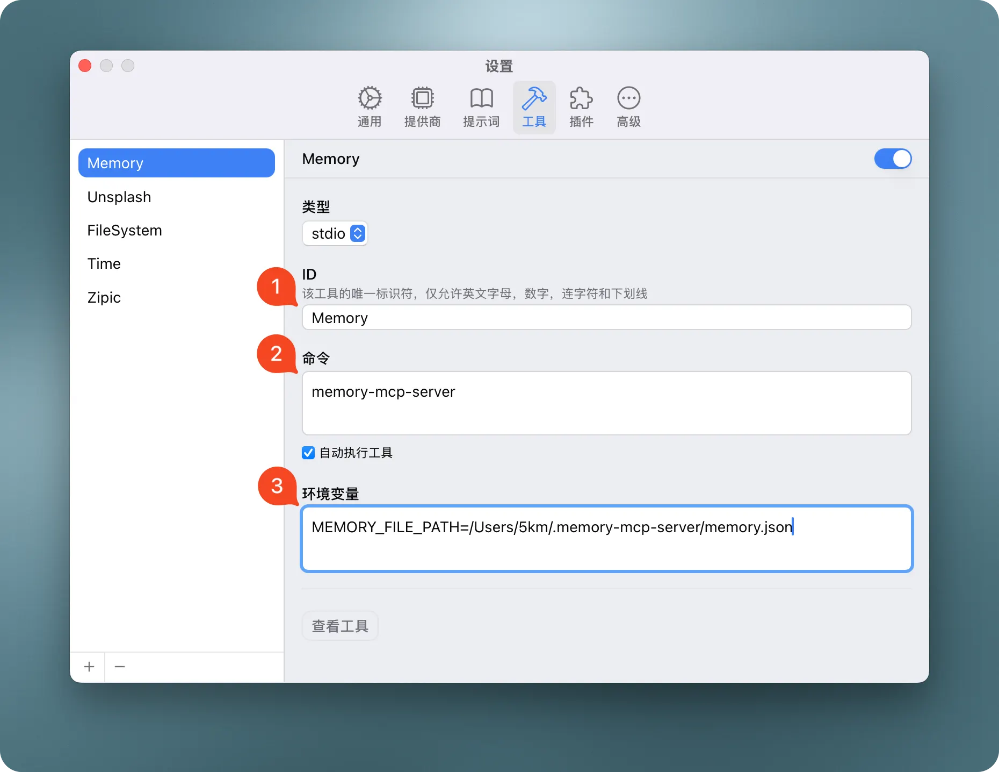

# Time MCP Server

> A Model Context Protocol server that provides time-related capabilities. This server enables LLMs to access current time information and convert times between different timezones. This is a Swift implementation of a time MCP server using the MCP Swift SDK.


## ✨ Features

* **Current Time Queries**: Get the current time in any timezone
* **Time Zone Conversions**: Convert time between different timezones
* **Daylight Saving Time Information**: Check if a timezone is currently in DST
* **Time Difference Calculation**: Get the time difference between timezones when converting

## Available Tools

* `get_current_time` - Get the current time in a specific timezone
  * `timezone` (string, required): IANA timezone name (e.g., 'America/New_York', 'Europe/London'). If empty or not provided, the system timezone will be used.

* `convert_time` - Convert time between timezones
  * `source_timezone` (string, required): Source IANA timezone name. If empty or not provided, the system timezone will be used.
  * `time` (string, required): Time to convert in 24-hour format (HH:MM)
  * `target_timezone` (string, required): Target IANA timezone name. If empty or not provided, the system timezone will be used.

## Installation

### Option 1: One-Line Installation (curl)

The easiest way to install is with the one-line installer, which automatically downloads the latest version and installs it to `~/.local/bin` in your home directory:

```bash
curl -fsSL https://raw.githubusercontent.com/okooo5km/time-mcp-server/main/install.sh | bash
```

The installer will:

* Create `~/.local/bin` if it doesn't exist
* Add this directory to your PATH (in .zshrc or .bashrc)
* Download and install the latest version
* Make the binary executable

### Option 2: Build from Source

1. Clone the repository:

   ```bash
   git clone https://github.com/okooo5km/time-mcp-server.git
   cd time-mcp-server
   ```

2. Build the project:

   ```bash
   swift build -c release
   ```

3. Install the binary:

   ```bash
   # Install to user directory (recommended, no sudo required)
   mkdir -p ~/.local/bin
   cp $(swift build -c release --show-bin-path)/time-mcp-server ~/.local/bin/
   ```

   Make sure `~/.local/bin` is in your PATH by adding to your shell configuration file:

   ```bash
   echo 'export PATH="$HOME/.local/bin:$PATH"' >> ~/.zshrc  # or ~/.bashrc
   source ~/.zshrc  # or source ~/.bashrc
   ```

## Command Line Arguments

The server supports the following command line arguments:

* `-h, --help`: Display help information about the server, its usage, and available options
* `-v, --version`: Display the version number of the time-mcp-server

Example usage:

```bash
# Display help information
time-mcp-server --help

# Display version information
time-mcp-server --version
```

### Configure for Claude.app

Add to your Claude settings:

```json
"mcpServers": {
  "RealTime": {
    "command": "time-mcp-server"
  }
}
```

### Configure for Cursor

Add the following configuration to your Cursor editor's Settings - mcp.json:

```json
{
  "mcpServers": {
    "RealTime": {
      "command": "time-mcp-server"
    }
  }
}
```



### Configure for ChatWise

Add the memory MCP server to your Chatwise Settings - Tools.


### Example System Prompt

You can use the following system prompt to help Claude utilize the time-mcp-server effectively:

```
You have access to time-related tools through MCP. Use these to help users:

- Get the current time in any timezone
- Convert times between timezones
- Calculate time differences between locations
- Plan meetings across different timezones

Use the following tools appropriately:
- `get_current_time` for checking the current time in a specific timezone
- `convert_time` when the user needs to convert between timezones

Always use proper IANA timezone names (e.g., 'America/New_York', 'Europe/London', 'Asia/Tokyo') 
rather than abbreviations or common names.
```

## Development Requirements

* Swift 6.0 or later
* macOS 14.0 or later
* MCP Swift SDK 0.2.0 or later

## Usage Examples

### Getting Current Time

```json
{
  "timezone": "America/New_York"
}
```

Response:

```json
{
  "timezone": "America/New_York",
  "datetime": "2024-11-05T14:30:45-05:00",
  "is_dst": false
}
```

### Converting Time

```json
{
  "source_timezone": "America/Los_Angeles",
  "time": "15:30",
  "target_timezone": "Asia/Tokyo"
}
```

Response:

```json
{
  "source": {
    "timezone": "America/Los_Angeles",
    "datetime": "2024-11-05T15:30:00-08:00",
    "is_dst": false
  },
  "target": {
    "timezone": "Asia/Tokyo",
    "datetime": "2024-11-06T08:30:00+09:00",
    "is_dst": false
  },
  "time_difference": "+17h"
}
```

## Use Cases

* **International Meeting Planning**: Schedule meetings across different timezones
* **Travel Planning**: Check local times at destination
* **Remote Work Coordination**: Coordinate work hours with international teams
* **Event Scheduling**: Set up global events with correct local times
* **Time-Sensitive Operations**: Ensure operations happen at the correct local time

## Version History

See GitHub Releases for version history and changelog.

## License

time-mcp-server is licensed under the MIT License. This means you are free to use, modify, and distribute the software, subject to the terms and conditions of the MIT License.

## About

A Swift implementation of a time server for Model Context Protocol (MCP), enabling AI assistants to access current time information and convert between timezones. This project is built using the MCP Swift SDK.
